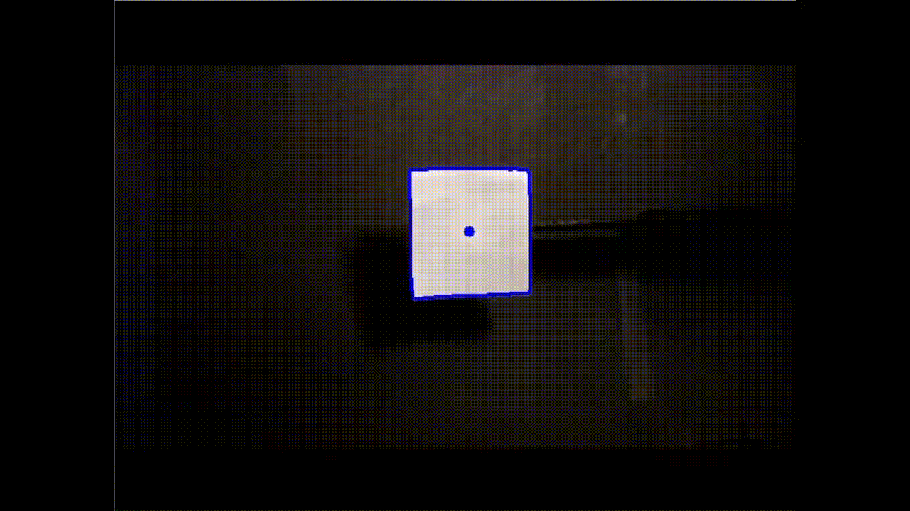

🎯 Object Tracking Robot with OpenCV, Python, and Arduino. 

- The goal of this project is to create an object tracking robot, with the object being a white square on a black background

Features
- Arduino and Python serial communication
- Real-time white object detection using the OpenCV library
- Servo-based camera movement (pan/tilt) to center the object within the cameras image

Hardware
- Webcam with USB A connection
- Arduino Uno (or compatible)
- Micro servo motors (2)
- Mount for camera to attach to servo motor. (depends on webcam)
- USB cable for Arduino
- Breadboard and jumper wires
- White object with black background (I used construction paper for both)

Software
- Python
- OpenCV, PySerial, time libraries
- Arduino IDE

How it Works
- This project integrated Python (using OpenCV, PySerial, and time libraries) with Arduino (using the Servo library) to create a webcam-based object tracking system. A webcam sends live video to my Python script, where OpenCV processes each frame by converting it to grayscale, applying a blur, converting to a binary image, and detecting contours. Once a large enough contour was found, the program identified its center and determined if it was aligned with the center of the frame. If not, Python sent directional commands (as single-character bytes) to an Arduino Uno via serial communication, which in turn adjusted two micro servo motors to re-center the object. The system allowed real-time feedback and movement, with safeguards to avoid crashes when contours were not detected or lighting caused false positives. 

- Improvements could include dynamically adjusting servo movement based on how far the object is from center. As of right now, the servo will only move the camera 3 degrees per step no matter how far away the object is. Future versions could determine the step of the servo based on the number of pixels away the object is from the center of the cameras image.

Demo 

Notes
- Best results are achieved in a controlled lighting area with a clean white object on a clean black background. Recommended using some sort of ring light pointed directly at the work space.
- You can tweak the servo angle step size, and the delay time between each step for better accuracy.
